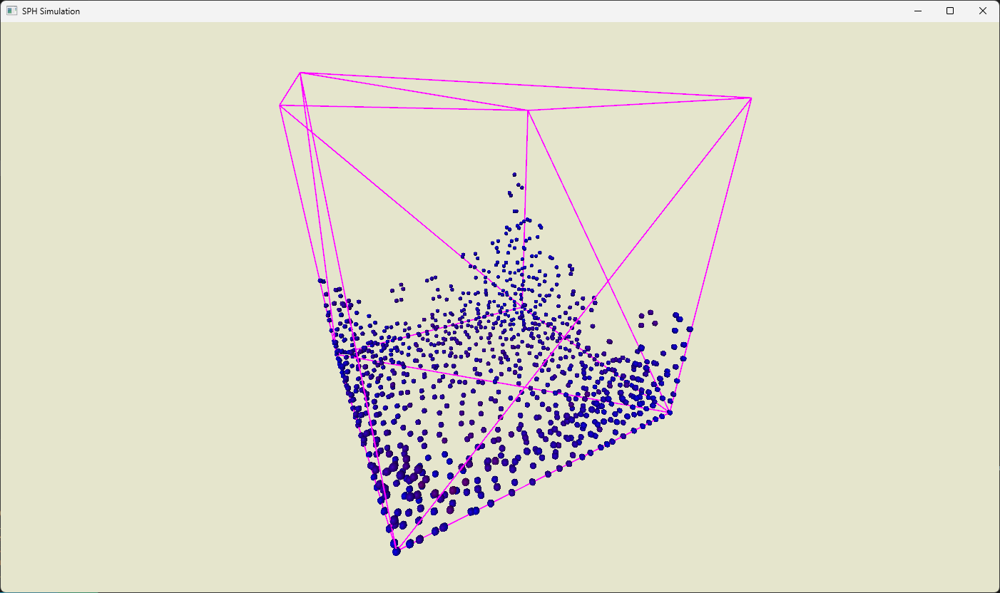

# Smoothed Particle Hydrodynamics
Basic implementation of 3D SPH in C++ and OpenGL.
<!-- image -->

  

## Features
- [x] OpenGL rendering
- [X] Boundary handling
- [x] Viscosity
- [x] Spatial hashed grid
- [ ] CUDA Implementation
- [ ] Surface tension
- [ ] Interactive mode