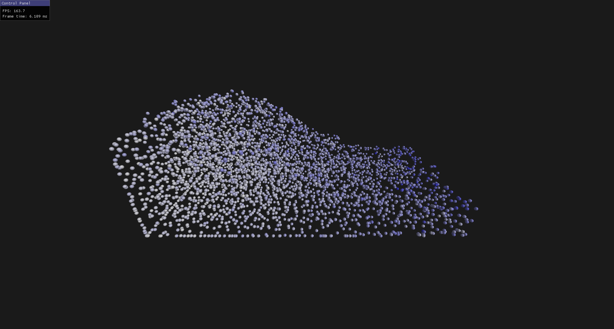

# Smoothed Particle Hydrodynamics
Basic implementation of 3D SPH in C++ and OpenGL.
<!-- image -->
<p align="center">
  
</p>

# How to nuild
```bash
mkdir build
cd build
cmake ..
make
```
# How to run
```bash
./sph
```

# Requirments
- CMake
- OpenGL
- GLFW
- GLAD
- GLM
- CUDA Toolkit (12.6)

# Note
- Export CUDA path in your bashrc or bash_profile
  ```bash
  export PATH=/usr/local/cuda-12.6/bin${PATH:+:${PATH}}
  export LD_LIBRARY_PATH=/usr/local/cuda-12.6/lib64${LD_LIBRARY_PATH:+:${LD_LIBRARY_PATH}}
  ```
- Incase you have multiple GPU's use 
  ```bash
  export __NV_PRIME_RENDER_OFFLOAD=1
  export __GLX_VENDOR_LIBRARY_NAME=nvidia
  ```


## Features
- [x] OpenGL rendering
- [X] Boundary handling
- [x] Viscosity
- [x] CUDA Implementation
- [ ] Spatial hashed grid
- [ ] Surface tension